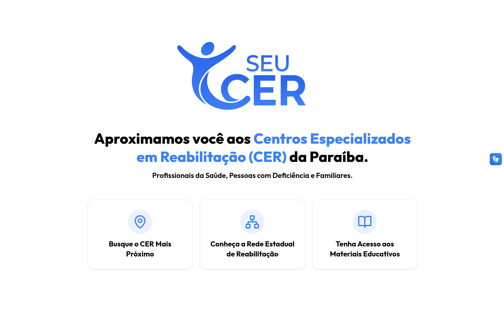
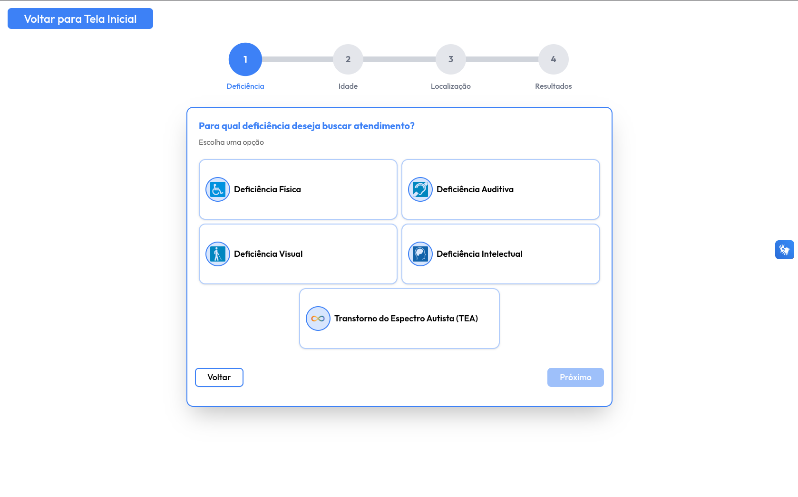
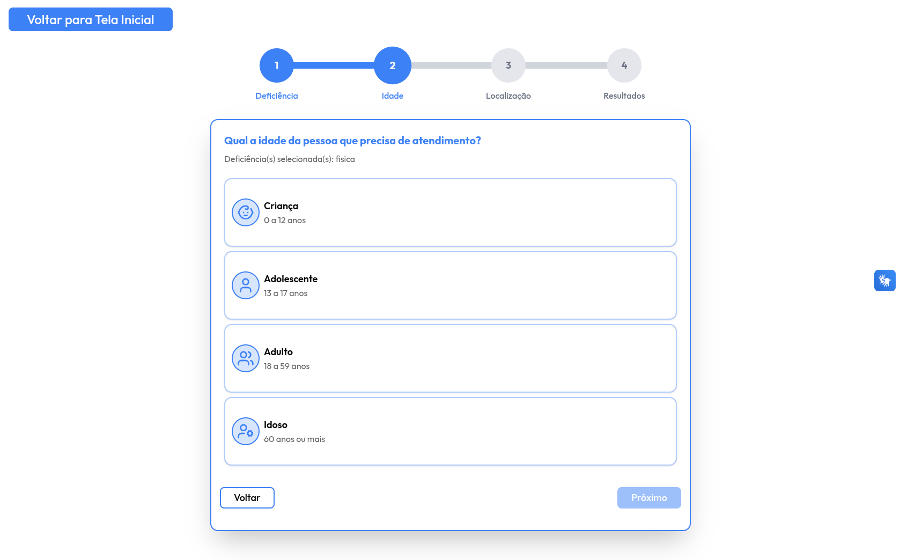
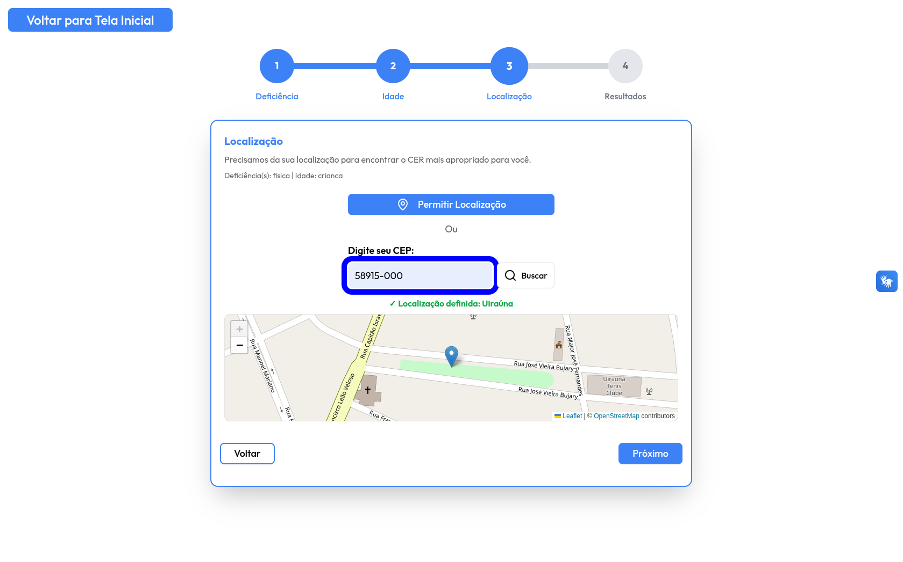
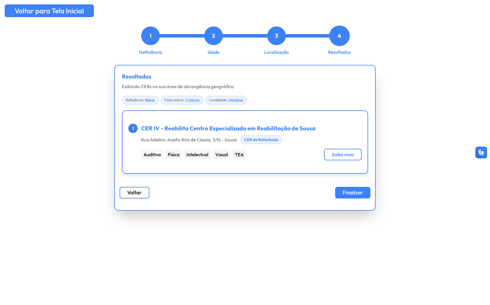
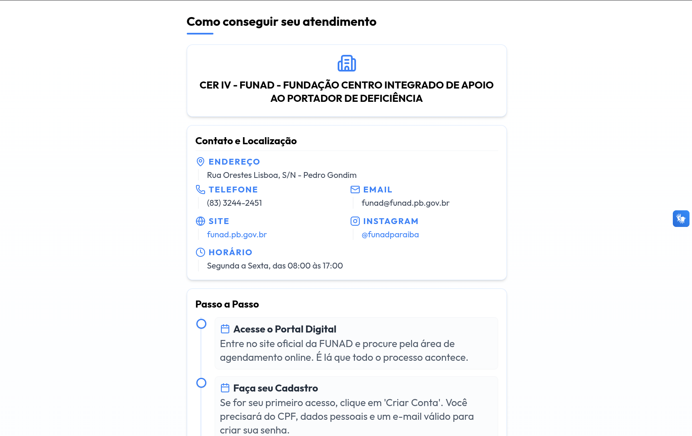
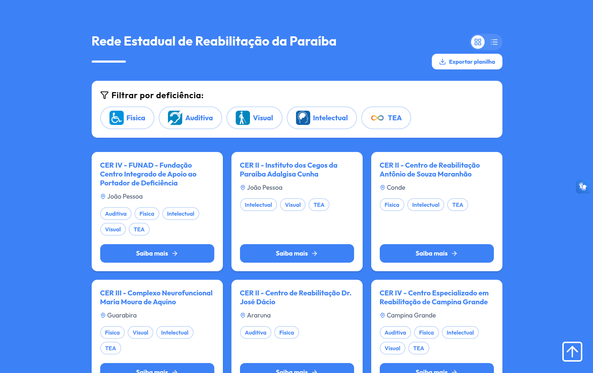
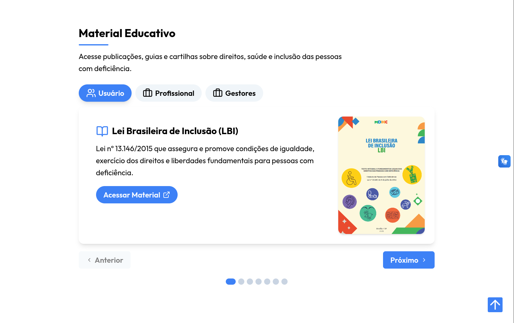
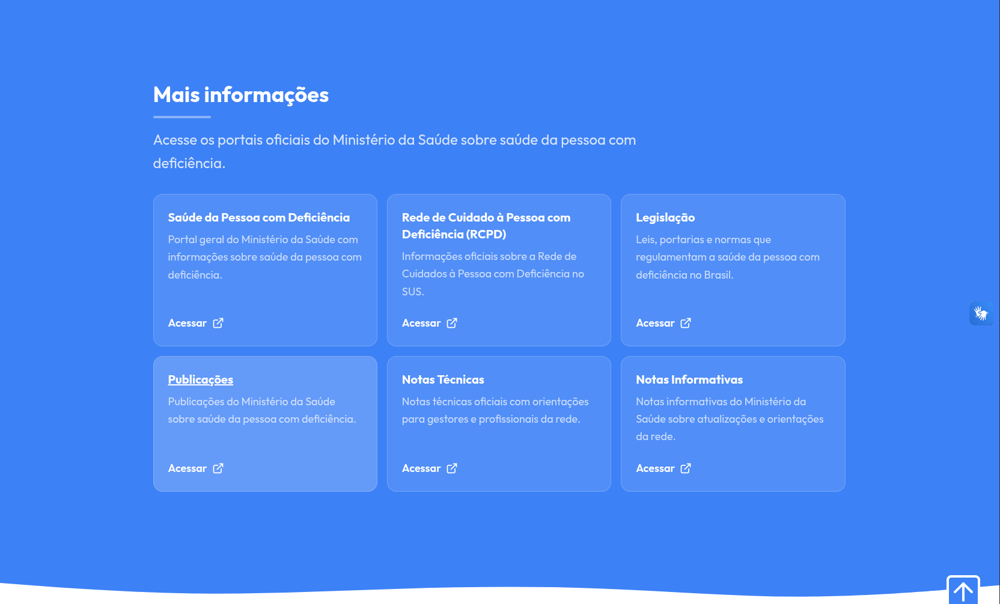

# Guia de Uso

Este documento descreve as funcionalidades do SeuCER e como utilizá-las.

**Acesse o site:** [pet-saude-digital-gt-01-pcd.github.io/cer-facil](https://pet-saude-digital-gt-01-pcd.github.io/cer-facil/)

---

## Sumário

- [Tela inicial](#tela-inicial)
- [Formulário de busca](#formulário-de-busca)
  - [Etapa 1 — Tipo de deficiência](#etapa-1--tipo-de-deficiência)
  - [Etapa 2 — Faixa etária](#etapa-2--faixa-etária)
  - [Etapa 3 — Localização](#etapa-3--localização)
  - [Etapa 4 — Resultados](#etapa-4--resultados)
- [Fluxo de atendimento](#fluxo-de-atendimento)
- [Cards de CERs](#cards-de-cers)
- [Material educativo](#material-educativo)
- [Links oficiais](#links-oficiais)
- [Acessibilidade](#acessibilidade)

---

## Tela inicial

A tela inicial apresenta o logo do projeto e três atalhos principais:

- **Busque o CER Mais Próximo** — inicia o formulário de busca.
- **Conheça a Rede Estadual de Reabilitação** — rola a página até os cards de CERs.
- **Tenha Acesso aos Materiais Educativos** — rola a página até a seção de material educativo.

---

## Formulário de busca

O formulário é dividido em 4 etapas. O indicador de progresso no topo mostra em qual etapa o usuário se encontra e permite voltar a etapas anteriores já preenchidas.

### Etapa 1 — Tipo de deficiência

Selecione o tipo de deficiência para o qual deseja buscar atendimento:

- Deficiência Física
- Deficiência Auditiva
- Deficiência Visual
- Deficiência Intelectual
- Transtorno do Espectro Autista (TEA)

---

### Etapa 2 — Faixa etária

Selecione a faixa etária da pessoa que precisa de atendimento:

- Criança (0 a 12 anos)
- Adolescente (13 a 17 anos)
- Adulto (18 a 59 anos)
- Idoso (60 anos ou mais)

---

### Etapa 3 — Localização

Informe sua localização de uma das duas formas:

- **Permitir Localização** — usa o GPS do dispositivo para detectar automaticamente a cidade.
- **CEP** — digite o CEP e o sistema identifica o município correspondente.

Após a localização ser detectada, um mapa é exibido para confirmação visual.

---

### Etapa 4 — Resultados

Exibe os CERs recomendados com base nas informações fornecidas. Um resumo das seleções feitas (deficiência, faixa etária e localidade) é exibido no topo. Cada resultado mostra:

- Nome e endereço do CER
- Especialidades atendidas
- Nível de cobertura (região direta, microrregião ou CER de referência de macrorregião)

Clique em **Saiba mais** em qualquer resultado para ver o fluxo de atendimento daquele CER.

---

## Fluxo de atendimento

Ao selecionar um CER nos resultados, é exibida uma página com:

- Informações de contato e localização do CER (endereço, telefone, e-mail, site, Instagram, horário)
- Passo a passo para conseguir atendimento
- Lista de documentos necessários
- Botão para baixar/imprimir as informações

---

## Cards de CERs

A seção de cards lista todas as unidades da rede com informações detalhadas:

- Nome e tipo do CER
- Endereço completo
- Especialidades
- Telefone, e-mail, site e Instagram
- Horário de funcionamento
- Botão para ver o fluxo de atendimento

---

## Material educativo

A seção de material educativo apresenta publicações organizadas em três abas:

- **Usuário** — materiais voltados para pessoas com deficiência e familiares.
- **Profissional** — guias e publicações para profissionais de saúde.
- **Gestores** — portarias, notas técnicas e notas informativas.

Navegue entre os materiais com os botões Anterior/Próximo ou pelos indicadores (dots) na parte inferior.

<!-- Link para material educativo complementar: a ser adicionado -->

---

## Links oficiais

A seção de links oficiais reúne acesso direto aos portais do Ministério da Saúde:

- Portal geral de saúde da pessoa com deficiência
- Rede de Cuidado à Pessoa com Deficiência (RCPD)
- Legislação
- Publicações
- Notas Técnicas
- Notas Informativas

---

## Acessibilidade

O site conta com:

- **VLibras** — widget de tradução para Língua Brasileira de Sinais (Libras), ativado pelo ícone no canto da tela.
- Navegação completa por teclado em todos os formulários e botões.
- Atributos `aria-label` e `role` nos elementos interativos.
- Respeito à preferência `prefers-reduced-motion` para animações.
- Textos alternativos em todas as imagens.
